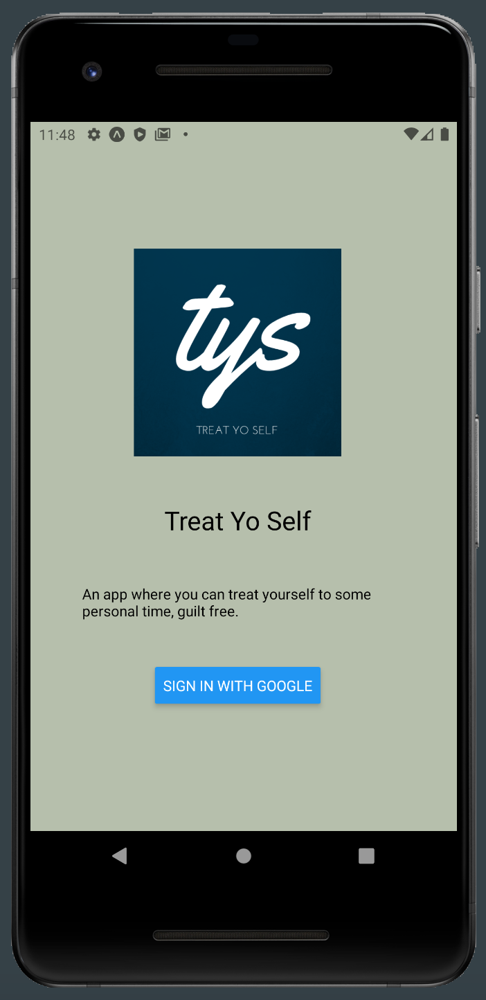
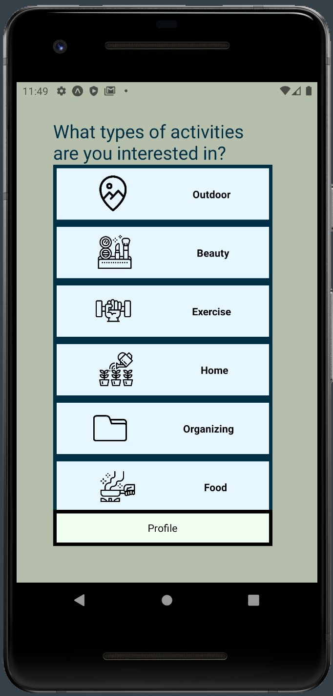

# Treat Yo Self
Contributors: Joel Lacey & Wren Steitle

## About 
Treat Yo Self is an Android application designed to help users take more time for themselves. Simply sign up and allow us to help you add self care activities into your busy schedule with our easy schedule service, allowing you to Treat Yo Self, guilt free.

Users can log in through Google OAuth and grant access for the application to modify their calendar. From there they can select the sorts of tasks they are interested in. With those submissions the Back End will calculate tasks they might enjoy. On their profile users can then choose to "Treat Yo Self" which will put one of these suggested tasks into their google calendar at an available time slot. They can view those events in their Google calendar, or within the app under the calendar display which will show their treat upcoming events. 

## Front End Technologies 
- React Native (utilizing Hooks)
- React Native Router
- Jest & React Renderer
- Apollo/GraphQL
- Expo Client
- Expo Google OAuth

## Setup 
1. On your Android phone download the Expo client from the Play Store.
2. Clone down this repo to a local directory.
3. Inside the root folder run Yarn.
4. Run Expo Start, this will launch the web bundler.
5. Scan the barcode in your terminal from within the Expo app to launch.

### Link to the Back End repo
https://github.com/TreatYoSelf/rails_be

#### Screenshots 

